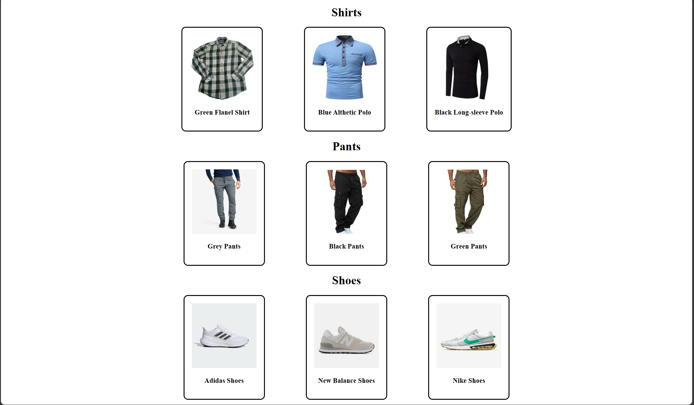
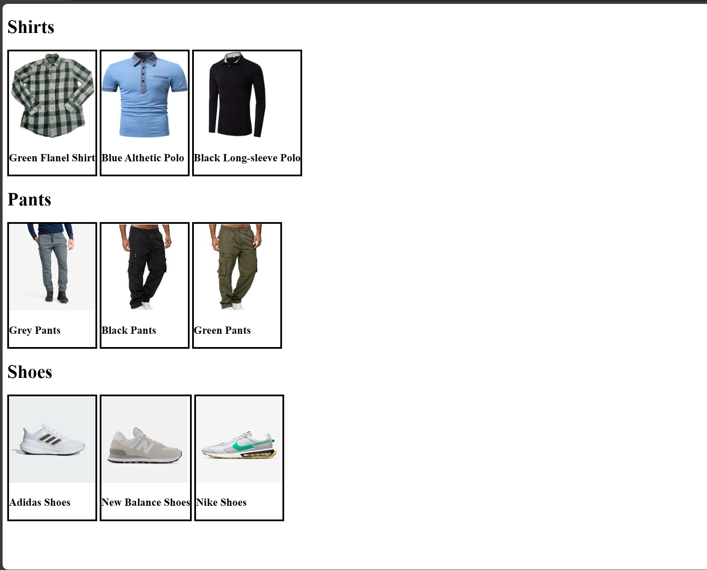
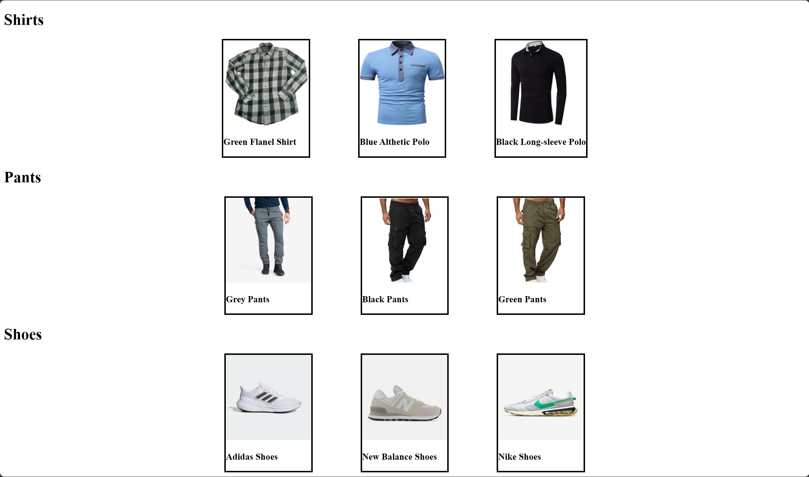
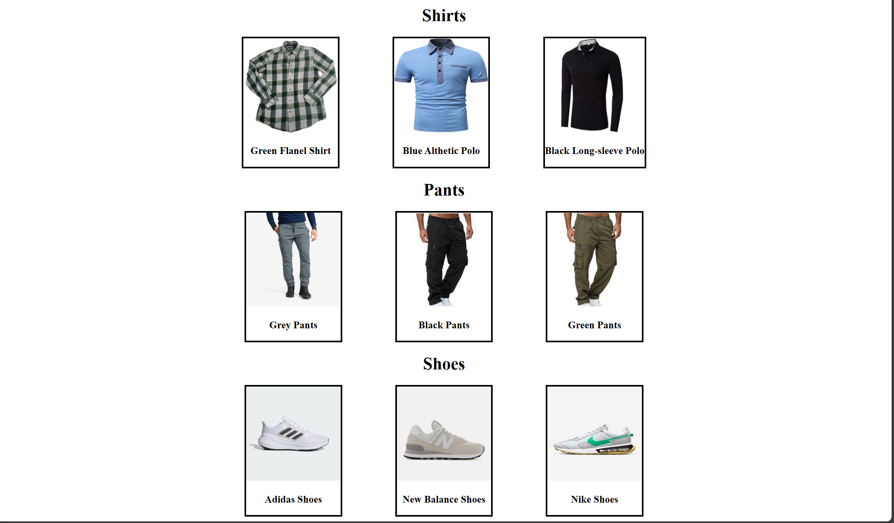

# The DOM (Document Object Model)

## Assignment: Clothing Catalog

For this assignment you will create a page to display clothing items for a store again but the CSS will be added through javascript

### Instructions

Your javascript code for this assignment will go inside the script tag at the bottom of [the html file](./index.html) on line 64

  
**Part 1: Align the clothing items horizontally**

  
Preview

   
  

 

  - Align the clothing items horizontally on the page
  
    - Change the [display](https://www.w3schools.com/Css/css_display_visibility.asp) CSS property on the clothing item dividers (divs) to '[inline-block](https://www.w3schools.com/Css/css_inline-block.asp)' to allow them to render without line-breaks.

      - [Use the document object to individually select each clothing item divider element by its id](https://www.w3schools.com/jsref/met_document_getelementbyid.asp) and change its CSS display property to 'inline-block' 

      - (The first row has been done for you)

 

**Part 2: Space-out and center the clothing items**

  
Preview

   
  

 

  - Create some space between the clothing items so they arent so close together.
  
  - Space the clothing items evenly across the screen.
    - Change the container elements for the clothing items into flexboxes and set the content to be centered

 

**Part 3: Center the item descriptions and category headers**

  
Preview

   
  

 

  - Center the category headers of Shirts, Pants and Shoes to the middle of the page.

  - Center the item descriptions for each of the clothing items. 

 

**Part 4: Add padding to the item containers, Round the borders of item containers** 

  
Preview

   
  

 

  - Add some internal padding to all the elements that contain the item image and description

  - Round the corners of the borders for the item containers

Take a look at Example.png for an idea of how the end result should look.
